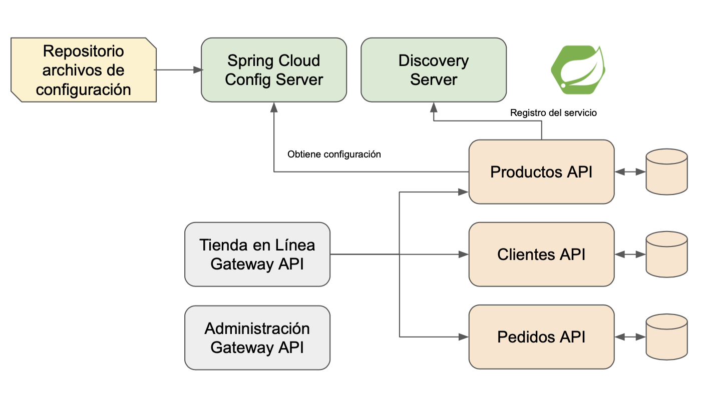

## La Tamalería 

### Hola a todos 👋

La Tamalería contiene diferentes proyectos web que simulan una tienda online. Tanto el código como la documentación están construidos principalmente en Español, se usa Inglés lo menos posible solo en los términos que son considerados estándar en el mundo de desarrollo. Entre los lenguajes de programación utilizados se encuentran Java y Javascript, pero no se descarta en el futuro utilizar otros lenguajes.

Los repositorios tienen diferentes niveles de complejidad, en este momento se encuentran en construcción y serán publicados en próximos días.

#### Por qué La-Tamalería

El tamal es quizás el producto más LatinoAmericano, tenemos tamales en todos nuestros países desde La Argentina hasta México (incluso en Brazil), y teniendo en cuenta que estos proyectos están dirigidos a desarrolladores quienes hablan Español de ahi el nombre.

#### Arquitectura 

## ⚡ Tecnologías

Las siguientes son algunas de las tecnologías que esperamos poder incluir en este proyecto

